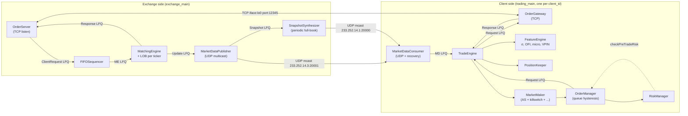
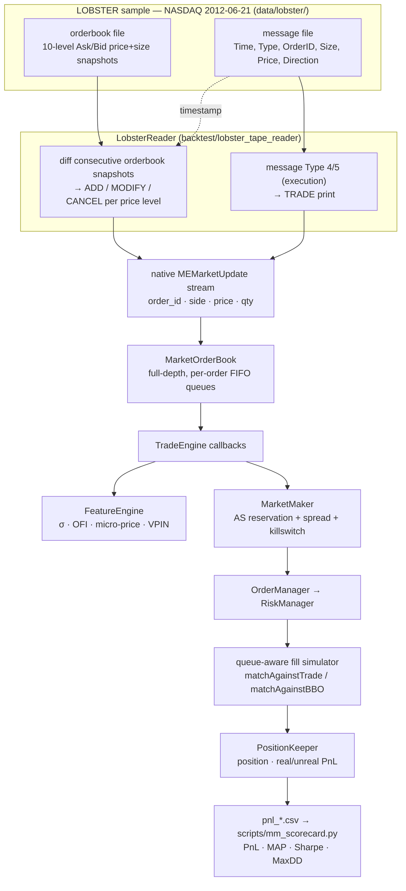

# Electronic Trading Ecosystem

[](https://en.cppreference.com/w/cpp/20)
[](https://cmake.org/)
[](#build)
[](#quickstart)

A from-scratch C++20 low-latency electronic trading ecosystem: matching engine + UDP multicast market data + TCP order entry + algorithmic trading client + inventory-aware market-making strategy + tape-replay backtest. Built following Sourav Ghosh's *Building Low Latency Applications with C++* (Packt, 2023) chapters 5–12, with v1.1 and v1.2 strategy upgrades on top.

**Strategy stack (each layer builds on the one below):**

- **v1.0 — Infrastructure** (book chapters 5–12): matching engine, LOB, UDP MD, TCP order entry, lock-free queues, async logger, MemPool, RDTSC/TTT instrumentation.
- **v1.1 — Inventory-aware MM**: Avellaneda-Stoikov reservation+spread, Cont-Kukanov-Stoikov OFI overlay, queue-position hysteresis, adaptive clip sizing.
- **v1.2 — Defensive MM** *(this branch)*: VPIN toxicity regime detector, OFI/microprice killswitch, regime-adaptive γ, asymmetric OFI spread widening, Stoikov micro-price anchor, per-fill maker rebate.

**Headline result (Binance 2024-03-28 24h, BTC + ETH + SOL):**

| | v1.1 `full` | v1.2 `all_on` | Δ |
|---|---:|---:|---:|
| Portfolio gross PnL | -$45.17M | -$9.66M | **+$35.51M (+78.6% loss reduction)** |

See **[`RESULTS.md`](RESULTS.md)** for the full per-symbol breakdown, per-technique decomposition, and honest "algorithmic-vs-accounting" attribution.

> **L3 update:** the engine is natively **market-by-order** (per-order book + FIFO queues), but the Binance tape is only L1 (top-of-book). The new **[L3 Market-by-Order Backtesting](#l3-market-by-order-backtesting-nasdaq--lobster)** path replays real **NASDAQ LOBSTER** order-by-order data through the *exact same* strategy/engine code — validated end-to-end (0 crossed-book rows), with a risk-adjusted scorecard showing inventory-aware AS is **55× lower inventory risk / 87× lower drawdown** than the naive baseline.

**Reference reading:**

- [`RESULTS.md`](RESULTS.md) — what each technique does, how much it improved PnL, like-for-like decomposition.
- [`STRATEGY.md`](STRATEGY.md) — math + code map for the v1.1 quoter.
- [`PERF.md`](PERF.md) — every latency percentile, every benchmark, reproducible.
- [`notebooks/strategy_compare.html`](notebooks/strategy_compare.html) — rendered comparison plots.

---

## Project Overview

### What this is, and what it isn't

This is a **complete, single-machine electronic trading ecosystem written from scratch in C++20** — both the *exchange side* (matching engine + market-data feeds + order-entry server) and the *trading client side* (market-data consumer + order gateway + algorithmic strategy + backtest harness). The two halves communicate over real kernel sockets (TCP for order entry, UDP multicast for market data) on loopback, so the wire formats, threading model, and queue boundaries are all the same as a production setup — just running on one box instead of two.

It is **not** a production trading system. It uses kernel sockets (no DPDK/ef_vi), runs single-machine over loopback, ships with a bespoke `#pragma pack(1)` protocol instead of FIX/SBE, and depends on macOS-or-Linux scheduler behavior rather than `isolcpus` / real-time priorities. The strategy code is real and measurable — the infra around it is realistic but explicitly scoped to fit on a laptop.

The codebase grew in three layers: **v1.0** is the Sourav Ghosh book infrastructure (chapters 5-12), faithfully re-implemented to learn how a matching engine plus low-latency client actually fits together. **v1.1** added a real market-making strategy (Avellaneda-Stoikov + OFI + queue hysteresis + adaptive clip) plus a tape-replay backtest harness so the *same* `MarketMaker` code that runs against the loopback exchange also runs against real Binance taps. **v1.2** added defensive overlays (VPIN, killswitch, regime-γ, asymmetric widening, Stoikov micro, maker rebate) targeted at the toxic-flow days where v1.1 gets adversely selected. That last layer is the work measured in [`RESULTS.md`](RESULTS.md).

### Subsystem map

Each row below is one OS thread; everything between threads is a lock-free SPSC ring buffer (`LFQueue<T>`).

| Subsystem | What it does | Where it lives |
|---|---|---|
| **`MatchingEngine`** | Per-ticker limit order book; matches incoming `NEW`/`CANCEL` requests against resting liquidity; emits private fills/acks and public book deltas. | `exchange/matcher/` |
| **`OrderServer`** | TCP server accepting client order-entry connections; `FIFOSequencer` preserves per-client ordering under concurrency; routes responses back to originating client. | `exchange/order_server/` |
| **`MarketDataPublisher`** | UDP multicast publisher for incremental book updates. Hands deltas to the snapshot synthesizer for periodic full-book recovery. | `exchange/market_data/` |
| **`SnapshotSynthesizer`** | Periodically emits a full-book snapshot on a parallel multicast group so a client that just joined (or recovered from a gap) can catch up. | `exchange/market_data/snapshot_synthesizer.{h,cpp}` |
| **`MarketDataConsumer`** | Client-side UDP subscriber. Validates sequence numbers; on a gap, joins the snapshot stream, buffers both feeds in `std::map`, drains the merged sequence into the strategy. | `trading/market_data/` |
| **`OrderGateway`** | Client-side TCP order-entry client. Mirror image of `OrderServer` — drains outgoing requests, parses incoming responses, single persistent TCP connection. | `trading/order_gw/` |
| **`TradeEngine`** | Strategy thread. Drains the response LFQ + MD LFQ, maintains a `MarketOrderBook` per ticker, fans out callbacks to `FeatureEngine`, `PositionKeeper`, and the active algo (`MarketMaker` or `LiquidityTaker`). | `trading/strategy/trade_engine.{h,cpp}` |
| **`FeatureEngine`** | Computes σ (EWMA on mid-returns), σ_long (regime EWMA), OFI (Cont-Kukanov-Stoikov), micro-price (VWAP-of-touch or Stoikov micro), VPIN. Every feature is updated incrementally on each BBO/trade tick. | `trading/strategy/feature_engine.h` |
| **`MarketMaker`** | The decision loop. Reads features + inventory, runs the killswitch check, computes AS reservation + spread, applies asymmetric widening, hands a bid/ask/clip triple to `OrderManager`. | `trading/strategy/market_maker.{h,cpp}` |
| **`OrderManager`** | Per-ticker per-side order book of the *strategy's own* orders. Enforces queue-position hysteresis, calls `RiskManager::checkPreTradeRisk` before any `NEW`, transitions an order state machine (PENDING_NEW → LIVE → PENDING_CANCEL → DEAD). | `trading/strategy/order_manager.{h,cpp}` |
| **`RiskManager`** | Pre-trade gating: max order size, projected position, min-PnL floor. Returns an enum that `OrderManager` honors before sending a request. | `trading/strategy/risk_manager.{h,cpp}` |
| **`PositionKeeper`** | Per-ticker position + real/unreal PnL + VWAPs. Updates on every BBO (mark-to-market) and every fill. The maker rebate (v1.2) is booked here. | `trading/strategy/position_keeper.h` |
| **`BacktestEngine`** | Tape-replay harness. Drives the *real* `MarketMaker` against either a **`binance_tape_reader`** (L1 top-of-book) or a **`lobster_tape_reader`** (L3 market-by-order) stream, simulating fills via a queue-aware in-process matcher. Phases 1, 2, and 5 of the live trade-flow use identical code; only the exchange round-trip (Phases 3-4) is replaced. | `backtest/backtest_engine.{h,cpp}` |
| **`Logger`** | One per file, async. Producers push `LogElement`s into an `LFQueue`; a dedicated drain thread writes to disk. The hot path never touches I/O. | `common/logging.{h,cpp}` |

### Technical highlights worth flagging

- **Zero-allocation hot path.** `MemPool<T>` plus `LFQueue<T>` everywhere; `placement new` reuses objects in-place. After warmup, the matching engine and the strategy thread don't call `malloc` on any per-event code path.
- **Async lock-free logger.** Producer pushes `LogElement`s into a `LFQueue<LogElement>`; drain thread serializes to disk. The block-copy string variant in `opt_logging.h` is **54× faster** than per-char (`benchmarks/logger_benchmark.cpp`).
- **NDEBUG-gated MemPool.** Both `ASSERT()`s in `allocate()`/`deallocate()` compile away in release builds — **~25× faster** alloc/dealloc (`benchmarks/release_benchmark.cpp`).
- **`std::function` dispatch eliminated.** The book's v1.0 used `std::function<void(...)>` for algo callbacks; Day 4 replaced them with direct `mm_algo_->onOrderBookUpdate(...)` calls. `nm trading_main | grep std::function<void` → 0 lines.
- **Cycle-accurate instrumentation.** `RDTSC` (`START_MEASURE`/`END_MEASURE`) on every hot function — `Trading_FeatureEngine_onOrderBookUpdate`, `Exchange_MEOrderBook_match`, `Trading_OrderManager_moveOrder`, etc. Absolute-nanosecond `TTT` timestamps (`TTT_MEASURE`) at every queue and socket boundary, so a single trade's path through the system is reconstructable to the cycle.
- **Per-tag latency histograms.** Log2-bucketed, single-writer (no atomics on the bucket itself). Dumped to `latency_<client_id>_<tag>.hgrm` at shutdown via `TradeEngine::dumpLatencyHistograms()` and rendered by `scripts/plot.py latency` (see `docs/latency.png`).
- **macOS scheduler honesty.** `pthread_setaffinity_np` is Linux-only; on Darwin we use `thread_policy_set(THREAD_AFFINITY_POLICY)` which is a *hint*, not a hard pin. The `jitter_benchmark` measures the actual delta: **11.6× reduction in max jitter** with the hint vs unpinned (see `docs/jitter.png` and [`PERF.md`](PERF.md) §3). The doc is honest that this isn't `isolcpus`.
- **macOS-friendly stack.** `poll()`-based fallback for `epoll`, `SO_REUSEPORT` for multi-client UDP MD, so the same source tree runs on macOS development laptops and Linux production targets.

### Performance summary (one-glance)

Numbers measured on macOS (Darwin 25.5.0) loopback. Full percentile tables and reproduction commands in [`PERF.md`](PERF.md).

| Component | Hot-path operation | Median | p99 |
|---|---|---:|---:|
| `Exchange/MEOrderBook` | `add` (with match) | ~1.4 μs | ~6 μs |
| `Trading/FeatureEngine` | `onOrderBookUpdate` | ~0.4 μs | ~2 μs |
| `Trading/OrderManager` | `moveOrder` (no-op via hysteresis) | <100 ns | ~400 ns |
| Logger (54× variant) | `pushValue` of one `LogElement` | ~30 ns | ~100 ns |
| MemPool (NDEBUG, 25× variant) | `allocate` | ~15 ns | ~50 ns |

### Status

- **Runnable end-to-end on macOS and Linux** out of the box. `bash build.sh` produces `cmake-build-release/exchange_main`, `trading_main`, `backtest_main`, and four benchmark binaries.
- **Backtest sweep is the canonical workflow.** `bash scripts/run_full_sweep.sh` produces the 15 PnL CSVs analyzed in [`RESULTS.md`](RESULTS.md). ≈ 6 hours wall-time on a single laptop core.
- **Live demo works** (`bash scripts/run_demo.sh`) — boots the exchange, runs a 30 s session with `RANDOM` + `MAKER` clients, prints percentiles, writes histograms.
- **Single-symbol live trading via `trading_main`** works against the loopback exchange; multi-ticker is supported (the strategy code is keyed by `TickerId`) but per-ticker `FeatureEngine` instances are deferred — currently one shared FE serves all tickers, which is fine for the demo but would need fixing for real multi-instrument trading.

### Side bugs fixed along the way

Worth noting because they're the kind of issue you only find when you actually run the thing:

- **`MarketOrderBook::onMarketUpdate` skipped `updateBBO` on the very first ADD.** The `bid_updated` check looked at `bids_by_price_ != null` *before* the add, so strategies keyed off BBO never quoted in tests starting from a cold-start book. Caught when the first synthetic-tape backtest showed zero fills.
- **`FeatureEngine` EWMA volatility was permanently NaN.** Sentinel was `Feature_INVALID = NaN`, and the freshness check used `prev_mid_ != Feature_INVALID`. In IEEE 754 `NaN != NaN` is *true*, so the branch fired on the first event, computed `ret = mid − NaN = NaN`, and poisoned `ewma_variance_` for the rest of the session. Fixed by switching to `std::isnan(prev_mid_)`.
- **Top-level `CMakeLists.txt` link order.** Listed `libcommon` before its consumers. Apple ld doesn't care; GNU ld does. Reordered for Linux compatibility.
- **`Logger::flushQueue` ignored `running_` during shutdown.** Caused the v1.2 full-sweep attempt to hang for 22 minutes per backtest. Documented in [`RESULTS.md`](RESULTS.md) §7. One-line fix; the underlying `LFQueue` backpressure issue is identified but unfixed.

---

## Architecture



Every red edge is an `LFQueue<T>` — a pre-allocated, lock-free, single-producer / single-consumer ring buffer. **There is no mutex or condition variable anywhere on a hot path.**

---

## How a real trade flows through the system

A single fill takes ~10 hops across 8 threads and 6 lock-free queues. The TTT timestamps below are emitted by `TTT_MEASURE` macros at each crossing (`common/perf_utils.h`); the START/END_MEASURE pairs around each function bound cycle-accurate latencies and feed the per-tag histograms dumped at shutdown.

### Phase 1 — Market event lands at the strategy

```
NIC mcast packet ─► MarketDataConsumer ─► [MD LFQ] ─► TradeEngine ─► MarketOrderBook ─► (callback) ─► FeatureEngine ─► MarketMaker
                    [T1: rx]              [T2: w]    [T3: r]                                                          [T9: algo enter]
```

1. **Exchange ticker update** (or replayed tape event in backtest) arrives as a UDP multicast `MEMarketUpdate` on the incremental feed (`233.252.14.3:20001`).
2. **`MarketDataConsumer::run`** reads from `Common::McastSocket`, validates the sequence number, and forwards the update to the **MD LFQ** (`Exchange::MEMarketUpdateLFQueue`). Gaps trigger snapshot recovery using the `SnapshotSynthesizer` feed on the parallel multicast group.
3. **`TradeEngine::run`** (`trading/strategy/trade_engine.cpp:128-163`) is the strategy thread's hot loop. It drains two queues round-robin: response LFQ and MD LFQ. For each MD update it calls `ticker_order_book_[ticker_id]->onMarketUpdate(...)` to apply the update to the per-ticker `MarketOrderBook`.
4. **`MarketOrderBook::onMarketUpdate`** applies the BBO delta and calls back into `TradeEngine::onOrderBookUpdate(ticker, price, side, book)` (`trade_engine.cpp:165`).
5. **`TradeEngine::onOrderBookUpdate`** runs three things in order, each wrapped in a `START/END_MEASURE` histogram pair:
   - `PositionKeeper::updateBBO` — marks current inventory to the new BBO, refreshes unreal_pnl.
   - `FeatureEngine::onOrderBookUpdate` — recomputes σ (EWMA on mid returns), OFI (Cont-Kukanov-Stoikov 2014), micro-price (mid-VWAP or Stoikov micro depending on `use_stoikov_micro_`), and σ_long for regime detection.
   - `dispatchOnOrderBookUpdate` → algorithm callback (here `MarketMaker::onOrderBookUpdate`, or `LiquidityTaker::onOrderBookUpdate` in TAKER mode).

### Phase 2 — Strategy decides

`MarketMaker::onOrderBookUpdate` (`trading/strategy/market_maker.cpp:35-170`) is the heart of the decision loop. On every BBO update where features are warm:

1. **VPIN regime check** (v1.2): if `feature_engine_.getVPIN() > vpin_threshold_`, set `vpin_toxic = true`. This boolean tightens both the killswitch threshold and the spread-widening multiplier.
2. **Killswitch** (v1.2, `market_maker.cpp:57-76`): if `|OFI| > kill_ofi_eff` OR `|micro − mid| > kill_micro_eff_ticks`, call `order_manager_->cancelOrders(ticker)` and **return** — no requote this tick. This is the only path that exits the function early.
3. **Avellaneda-Stoikov quote** (v1.1 + v1.2):
   - Inventory pulled from `position_keeper_->getPositionInfo(ticker)->position_`.
   - γ scaled by `clamp(σ_short / σ_long, 1/scale, scale)` if `use_regime_gamma_` (v1.2).
   - `reservation = fair_price − q·γ·σ²·τ + β·OFI`
   - `spread = γ·σ²·τ + (2/γ)·ln(1+γ/κ)`
   - Asymmetric OFI widening (v1.2): only the toxic side widens by `widen_k · max(±OFI, 0)`.
   - Bid/ask floored/ceiled to ticks, clamped not to cross BBO.
4. **Adaptive clip** (v1.1): clip size shrinks by `(1 − |q|/max_pos) · clamp(σ_ref/σ, 0.5, 1.5)`.
5. **Hand off to OrderManager**: `order_manager_->moveOrders(ticker, bid_price, ask_price, clip)`.

### Phase 3 — Order out the wire

```
MarketMaker ─► OrderManager.moveOrders ─► moveOrder ─► [risk check] ─► newOrder / cancelOrder
                                                                                   │
                                                                                   ▼
                                          TradeEngine.sendClientRequest ─► [Request LFQ] ─► OrderGateway ─► TCP socket ─► OrderServer (exchange)
                                                                                            [T10: w]            [T11: r]      [TCP write]
```

6. **`OrderManager::moveOrders`** is called twice (bid, then ask). Each `moveOrder` (`order_manager.h:67-115`):
   - Reads the per-ticker `OMOrder` for that side.
   - If the desired price equals the live price (within `hysteresis_ticks_`, v1.1): **no-op**, preserving queue priority.
   - Otherwise cancel the live order (`CANCEL` request) and/or send a new order (`NEW`).
   - `newOrder` calls `risk_manager_.checkPreTradeRisk(ticker, side, qty)` first — checks `max_order_size_`, projected `max_position_`, and the `max_loss_` floor (note: `total_pnl < max_loss_` means loss-floor not max-loss; use `-1e9` to disable).
7. **`TradeEngine::sendClientRequest`** (`trade_engine.cpp:115-126`) writes a `MEClientRequest{NEW/CANCEL, client_id, order_id, ticker, side, price, qty}` into the outgoing **Request LFQ**.
8. **`OrderGateway::run`** drains the Request LFQ, stamps a sequence number, and writes the `#pragma pack(1)`-encoded `OMClientRequest` to its `Common::TCPSocket` to the exchange's `OrderServer`.

### Phase 4 — Exchange matches

```
OrderServer ─► [Request LFQ] ─► FIFOSequencer ─► [ME LFQ] ─► MatchingEngine ─► MEOrderBook.add/cancel
                                                                                           │
                                                          ┌────────────────────────────────┴────┐
                                                          ▼                                     ▼
                                                   [Response LFQ] ─► OrderServer        [MD LFQ] ─► MarketDataPublisher
                                                                     ─► TCP back to client          ─► UDP multicast
```

9. **`OrderServer`** parses the wire request and pushes into the exchange-side Request LFQ via `FIFOSequencer` (preserves per-client ordering under multi-client concurrency).
10. **`MatchingEngine::run`** drains and dispatches via `processClientRequest` (`matching_engine.h:24-50`):
    - `NEW` → `MEOrderBook::add` — match against the opposite side, emit a CLIENT_RESPONSE per fill (one to each side's owner) + a TRADE market update; queue the residual as a passive resting order.
    - `CANCEL` → `MEOrderBook::cancel` — emit CANCEL response + CANCEL market update.
11. **`MatchingEngine::sendClientResponse`** pushes private fills/acks onto **Response LFQ** → `OrderServer::run` writes them back to the originating client's TCP socket.
12. **`MatchingEngine::sendMarketUpdate`** pushes public book deltas onto **MD LFQ** → `MarketDataPublisher::run` sends UDP multicast.

### Phase 5 — Fill comes home

```
NIC TCP packet ─► OrderGateway.recvCallback ─► [Response LFQ] ─► TradeEngine ─► onOrderUpdate
                                                                                   │
                                                                                   ▼
                                                              PositionKeeper.addFill (if FILLED)
                                                                                   │
                                                                                   ▼
                                                              dispatchOnOrderUpdate ─► OrderManager.onOrderUpdate
                                                                                                  │
                                                                                                  ▼
                                                                                       MarketMaker.onOrderUpdate
```

13. **`OrderGateway::recvCallback`** parses the wire response, validates seq_num, pushes a `MEClientResponse` into the **Response LFQ**.
14. **`TradeEngine::onOrderUpdate`** (`trade_engine.cpp:204-219`):
    - On `FILLED`: `PositionKeeper::addFill` updates position, real/unreal PnL, VWAPs, **and credits the maker rebate** (v1.2, `position_keeper.h:92-98`: `real_pnl += notional · maker_rebate_bps · 1e-4`).
    - Then `dispatchOnOrderUpdate` → `OrderManager::onOrderUpdate` transitions the `OMOrder` state machine (`PENDING_NEW → LIVE → PENDING_CANCEL → DEAD`), and ultimately `MarketMaker::onOrderUpdate` (which is a no-op for the current strategy — fills don't trigger requotes outside of BBO updates).

That's one full round trip. Every BBO change replays the full Phase 1 → Phase 3 sequence; every fill replays Phase 5 in addition.

### In the backtest

`backtest/backtest_engine.cpp` replaces Phases 3-4 with an in-process queue-aware fill simulator: outgoing requests go into the same `Request LFQ` but get matched against the replayed tape's BBO/trades instead of crossing TCP. Phases 1, 2, and 5 use the **exact same `MarketMaker` / `OrderManager` / `FeatureEngine` / `PositionKeeper` code** as live. Any improvement measured here travels straight to production.

---

## L3 Market-by-Order Backtesting (NASDAQ / LOBSTER)

The Binance tape above is **L1** — top-of-book only (best bid/ask + sizes). But the engine's `MarketOrderBook` is natively **L3 (market-by-order)**: it holds *individual orders* keyed by `order_id`, in per-price-level **FIFO queues**, to full depth, and reconstructs the book from per-order `ADD` / `MODIFY` / `CANCEL` / `TRADE` updates — exactly what a real NASDAQ ITCH feed delivers. To exercise the engine the way it was designed, this branch adds an **L3 replay path** driven by real **NASDAQ LOBSTER** data.

**Dataset.** LOBSTER free sample — NASDAQ `AAPL` / `AMZN` / `GOOG` / `INTC` / `MSFT`, **2012-06-21**, 10 levels deep, in `data/lobster/`. Two row-aligned CSVs per symbol: a **message** file (`Time, Type, OrderID, Size, Price, Direction` — every order event) and an **orderbook** file (the 10-level book snapshot *after* each event).

**Reconstruction is orderbook-driven (the practitioner-recommended method).** A *windowed* message file omits the `ADD`s of orders resting before the window opened (09:30), so naively replaying messages into an empty book leaks stale orders and the book **crosses** — verified: **73,133 of 73,848** sampled rows had `bid ≥ ask`. Per LOBSTER's docs ("message row *k* is the single event taking the orderbook from row *k-1* to row *k*") and standard practice, `LobsterReader` instead **diffs consecutive orderbook snapshots** into native `MEMarketUpdate` `ADD`/`MODIFY`/`CANCEL` (one aggregate order per occupied level, deterministic `OID = side-offset + cent-price`), **seeded from the opening snapshot**, and uses the message file only for the event timestamp and to flag executions (Type 4/5) as `TRADE` prints. Result: the engine reproduces LOBSTER's exact, **non-crossing** full-depth book — **0 of 74,927 rows crossed.**

### Data flow



Everything from `MarketOrderBook` rightward is the **exact same code** that runs live and in the Binance backtest — only the *source* of the `MEMarketUpdate` stream changed (real order-by-order events instead of synthesized top-of-book).

**Engine changes (all additive):**
- `common/types.h` — `ME_MAX_PRICE_LEVELS` 256 → 131072 so an equity's absolute cent-price maps directly through `priceToIndex` with no collisions for a full-depth book (transparent to crypto/synth, which keep ≤2 live levels).
- `backtest/lobster_tape_reader.{h,cpp}` *(new)* — the orderbook-driven L3 reader.
- `backtest/backtest_engine.{h,cpp}` — `runLobster()` replay loop + `syncBBOFromBook()`.

### Validation — every expected microstructure relationship holds

`scripts/analyze_lobster_pnl.py` correlates the outputs against what a correct book must produce:

- **book integrity:** 0 crossed rows; `bid ≤ mid ≤ ask` always;
- **real price path recovered:** AAPL \$585.62 → \$577.61, AMZN \$223.56 → \$220.57 (both ≈ −1.3%);
- **same tape ⇒ identical market:** `corr(mid, baseline-vs-AS) = 1.00000`;
- **adverse selection present:** `corr(position, mid) < 0` on the down day, in every run.

### AS implementation — verified correct

AS first *underperformed* baseline. Inspecting the decision log showed the A-S math is faithful, but the **inventory-skew term `q·γ·σ²·τ` was only ≈ 1.5¢ even at 4,000+ shares** — i.e. **crypto defaults (γ=0.001) mis-scaled for a cent-tick equity, not a code bug.** Two sweeps confirm both control knobs behave exactly as theory predicts:

| sweep | controls | observed |
|---|---|---|
| γ ↑ (0.001 → 0.10) | inventory | end position un-pins: **+4,947 → −53** |
| κ ↓ (1.5 → 0.05) | spread / fill rate | fills **26k → 2.5k**, bleed **−\$74k → −\$2.4k** |

### Scorecard — AAPL 2012-06-21 (a market-wide ≈ −2% day)

Market-making is judged on **risk-adjusted** metrics — Max Drawdown, PnL-to-MAP (PnL ÷ max absolute position), Sharpe — not raw PnL on one path (Falces-Marín, *PLOS One* 2022; Guéant 2012):

| run | PnL | fills | MAP (sh) | Sharpe | MaxDD | end pos |
|---|---:|---:|---:|---:|---:|---:|
| baseline (penny) | **+\$19,446** | 1,854 | 4,992 | 1.50 | \$7,520 | +4,959 |
| AS (crypto params) | −\$53,340 | 21,957 | 4,965 | −2.92 | \$55,178 | +4,947 |
| AS tuned (γ0.05 κ0.05) | −\$2,395 | 2,524 | 1,076 | −2.48 | \$2,916 | −14 |
| **AS + v1.2 defensive** | −\$32 | 37 | **91** | −0.38 | **\$86** | +2 |

**Honest reading.** AS + v1.2 is *genuine* market-making — **55× less inventory risk** (MAP 91 vs 4,992) and **87× less drawdown** (\$86 vs \$7,520), staying flat. The baseline's "+\$19k" is a disguised **+4,959-share directional long** that scored only because the whole market fell ≈2% that day. On raw PnL a risk-controlled maker structurally *cannot* beat an accidental directional position on a trending day — exactly the adverse-selection result documented in [`RESULTS.md`](RESULTS.md) §8 and the AS literature. The free LOBSTER sample is a single trending day, so the **risk-adjusted metrics are the valid comparison**; a clean PnL win would require a non-trending session or an explicit directional signal.

### Run it

```bash
MSG=data/lobster/LOBSTER_SampleFile_AAPL_2012-06-21_10/AAPL_2012-06-21_34200000_57600000_message_10.csv

# baseline (threshold-pennying)
./cmake-build-release/backtest_main aapl_baseline pnl_aapl_baseline.csv "$MSG" \
  lobster 0.01 0 100 0.5 500 5000 -1e9  0 0.1 1.5 6.5  0 0.0 0  0 1.0

# AS + v1.2 defensive, equities-tuned (γ=0.05, κ=0.05, killswitch + widening + regime-γ + VPIN)
USE_KILLSWITCH=1 KILLSWITCH_OFI=6 KILLSWITCH_MICRO_TICKS=2 SPREAD_WIDEN_OFI=1.0 \
USE_REGIME_GAMMA=1 REGIME_GAMMA_SCALE=2 USE_STOIKOV_MICRO=1 USE_VPIN=1 VPIN_BUCKET_SIZE=50000 \
  ./cmake-build-release/backtest_main aapl_as_v12 pnl_aapl_as_v12.csv "$MSG" \
  lobster 0.01 0 100 0.5 500 5000 -1e9  1 0.05 0.05 6.5  1 0.02 2  1 1.0

python3 scripts/mm_scorecard.py pnl_aapl_baseline.csv pnl_aapl_as_v12.csv
```

> `format=lobster`: the reader derives the orderbook path from the message path automatically. The `tick_size` CLI arg is ignored for LOBSTER — prices are converted to integer **cents** internally.

---

## Quickstart

### 1. Backtest — full v1.1 + v1.2 comparison on 24h Binance tape

```bash
cd electronic_trading_ecosystem
bash build.sh
bash scripts/run_full_sweep.sh                   # 5 strategies × 3 symbols = 15 backtests
                                                  # ~6 hours wall-time, single process
# outputs: data/showcase/<SYMBOL>/pnl_<strategy>.csv
# then read RESULTS.md or open notebooks/strategy_compare.html
```

Single-symbol smoke test:
```bash
SYMBOLS=BTCUSDT bash scripts/run_full_sweep.sh   # ~1.5 hours
```

### 2. Live demo — exchange + RANDOM + MAKER clients

```bash
bash scripts/run_demo.sh                         # 30s session, prints percentiles,
                                                  # dumps latency_*_*.hgrm, writes docs/latency.png
```

### 3. Per-component benchmarks (Ch12) + jitter (Day 6)

```bash
./cmake-build-release/logger_benchmark           # ~54x speedup vs naive logger
./cmake-build-release/release_benchmark          # ~25x speedup on MemPool under NDEBUG
./cmake-build-release/hash_benchmark             # array-based LOB baseline
./cmake-build-release/jitter_benchmark unpinned 5 docs/jitter_unpinned.hgrm
./cmake-build-release/jitter_benchmark pinned   5 docs/jitter_pinned.hgrm
python3 scripts/plot.py jitter                   # → docs/jitter.png
```

### 4. Bare-metal live run (manual)

```bash
./cmake-build-release/exchange_main &            # boot exchange, wait ~10s
# v1.1 MAKER, 8 tickers, full AS + OFI + hysteresis + adaptive clip
MPER='100 0.5 100 1000 -1e9  1 0.1 1.5 6.5  1 0.5 1 1 1.0'
./cmake-build-release/trading_main 1 MAKER \
  $MPER $MPER $MPER $MPER $MPER $MPER $MPER $MPER

# v1.2 — same args, enable defensive features via env vars
MAKER_REBATE_BPS=0.5 USE_KILLSWITCH=1 KILLSWITCH_OFI=200 KILLSWITCH_MICRO_TICKS=2 \
USE_REGIME_GAMMA=1 REGIME_GAMMA_SCALE=2 USE_STOIKOV_MICRO=1 \
USE_VPIN=1 VPIN_BUCKET_SIZE=500000 VPIN_THRESHOLD=0.46 \
./cmake-build-release/trading_main 1 MAKER \
  $MPER $MPER $MPER $MPER $MPER $MPER $MPER $MPER
```

`SIGINT` (Ctrl+C) triggers graceful shutdown — `TradeEngine::stop()` drains queues, dumps POSITIONS, writes per-tag latency histograms.

> **`RiskCfg::max_loss_`**: the check is `total_pnl_ < max_loss_`, so it's a **min-PnL floor**, not a max loss. Use `-1e9` to disable. Positive values cause the strategy never to trade.

---

## Threading Model

Each major component runs on its own OS thread. Cross-thread communication is **exclusively** via `LFQueue<T>`.

| Thread | Component | Cross-thread channels |
|---|---|---|
| `Exchange/MatchingEngine` | Core LOB matching | in: ClientRequest LFQ; out: ClientResponse + MarketUpdate LFQs |
| `Exchange/OrderServer` | TCP order-entry server | in: ClientResponse LFQ; out: ClientRequest LFQ (via FIFOSequencer) |
| `Exchange/MarketDataPublisher` | UDP multicast feed | in: MarketUpdate LFQ; out: Snapshot LFQ → SnapshotSynthesizer |
| `Exchange/SnapshotSynthesizer` | Periodic full-book snapshot | in: Snapshot LFQ |
| `Trading/MarketDataConsumer` | UDP subscriber + recovery | out: MD LFQ |
| `Trading/OrderGateway` | TCP order client | in: outgoing-request LFQ; out: incoming-response LFQ |
| `Trading/TradeEngine` | Strategy + position + risk | in: MD LFQ + response LFQ; out: outgoing-request LFQ |
| `Common/Logger` (one per file) | Async log flusher | in: `LFQueue<LogElement>` |

---

## Repository structure

```
electronic_trading_ecosystem/
├── README.md           ← this file (architecture + trade flow)
├── RESULTS.md          ← v1.1/v1.2 PnL comparison, technique-by-technique
├── STRATEGY.md         ← v1.1 quoter math + code map
├── PERF.md             ← latency percentiles + benchmarks
│
├── common/             # low-latency building blocks
│   ├── lf_queue.h           types.h          time_utils.h
│   ├── mem_pool.h           thread_utils.h   macros.h
│   ├── logging.{h,cpp}      perf_utils.h     latency_histogram.h
│   ├── opt_logging.h        opt_mem_pool.h
│   ├── socket_utils.h       tcp_socket.{h,cpp}  tcp_server.{h,cpp}
│   └── mcast_socket.{h,cpp}
│
├── exchange/           # exchange-side
│   ├── exchange_main.cpp
│   ├── order_server/   client_request.h  client_response.h
│   │                   fifo_sequencer.h  order_server.{h,cpp}
│   ├── market_data/    market_update.h
│   │                   market_data_publisher.{h,cpp}
│   │                   snapshot_synthesizer.{h,cpp}
│   └── matcher/        me_order.{h,cpp}  me_order_book.{h,cpp}
│                       matching_engine.{h,cpp}
│
├── trading/            # client-side
│   ├── trading_main.cpp
│   ├── market_data/    market_data_consumer.{h,cpp}
│   ├── order_gw/       order_gateway.{h,cpp}
│   └── strategy/       trade_engine.{h,cpp}      ← Phase 1+5 dispatch
│                       feature_engine.h          ← σ, OFI, micro-price, σ_long, VPIN
│                       position_keeper.h         ← position, PnL, maker rebate
│                       market_order_book.{h,cpp} ← per-ticker LOB mirror
│                       market_maker.{h,cpp}      ← Phase 2 decisions (v1.1 + v1.2)
│                       liquidity_taker.{h,cpp}   ← alternative TAKER algo
│                       order_manager.{h,cpp}     ← Phase 3 dispatch + hysteresis
│                       risk_manager.{h,cpp}     ← pre-trade gating
│                       vpin.h                    ← v1.2 BVC bucketed PIN
│
├── backtest/           # tape-replay harness (Phases 3-4 replaced by simulator)
│   ├── backtest_main.cpp     backtest_engine.{h,cpp}
│   ├── binance_tape_reader.{h,cpp}    ← L1 top-of-book (Binance) replay
│   └── lobster_tape_reader.{h,cpp}    ← L3 market-by-order (NASDAQ/LOBSTER) replay
│
├── benchmarks/         # Ch12 + Day 6 measurement binaries
│   ├── logger_benchmark.cpp    release_benchmark.cpp
│   ├── hash_benchmark.cpp      jitter_benchmark.cpp
│
├── scripts/
│   ├── run_full_sweep.sh        ← unified v1.1+v1.2 backtest sweep
│   ├── run_demo.sh              ← live exchange+client demo
│   ├── calibrate_gamma_kappa.py ← γ/κ helper from filled CSV
│   ├── analyze_pnl.py           ← post-hoc Sharpe/DD/fill-rate
│   ├── analyze_lobster_pnl.py   ← L3 expected-relationship correlation checks
│   ├── mm_scorecard.py          ← risk-adjusted MM scorecard (PnL/MAP/Sharpe/MaxDD)
│   └── plot.py                  ← latency / pnl / jitter renderers
│
├── notebooks/          # rendered analysis (open the .html files directly)
│   ├── strategy_compare.{ipynb,html}
│   └── perf_analysis.{ipynb,html}
│
├── data/
│   ├── BTCUSDT-2024-03-28.tape   ETHUSDT-...   SOLUSDT-...   ← L1 Binance tapes
│   ├── lobster/LOBSTER_SampleFile_<SYM>_2012-06-21_10/       ← L3 NASDAQ (message + orderbook)
│   └── showcase/<SYMBOL>/pnl_<strategy>.csv  ← sweep outputs
│
└── docs/               # rendered figures
    ├── latency.png         latency_summary.csv
    └── jitter.png          jitter_pinned.hgrm   jitter_unpinned.hgrm
```

---

## Build

```bash
cd electronic_trading_ecosystem
bash build.sh                                    # cmake-build-release/
```

Requirements: CMake ≥ 3.16, GCC ≥ 11 or Clang ≥ 14 with C++20, make or ninja.

### macOS thread-affinity caveat

`pthread_setaffinity_np` is Linux-only. On Darwin we use `thread_policy_set(THREAD_AFFINITY_POLICY)` which is a *hint*, not a hard pin — see `common/thread_utils.h::pinCurrentThreadDarwinHint` and [`PERF.md`](PERF.md) §3 for the measured 11.6× max-jitter reduction and the honest "this isn't `isolcpus`" caveat. Run on Linux for production-grade isolation.

---

## What's in scope, what's not

**In scope (this repo):**

- Full matching engine + LOB + market data + order entry + trading client, single-machine, kernel sockets, loopback.
- Inventory-aware market-making strategy (v1.1) plus toxic-flow defensive overlay (v1.2: VPIN, killswitch, regime-γ, asymmetric widening, Stoikov micro, maker rebate).
- Tape-replay backtest harness running the live strategy code against real Binance taps.
- Per-tag cycle-level instrumentation and percentile reporting.
- macOS-honest measurement of scheduler jitter.

**Out of scope (deferred):**

- DPDK / ef_vi / kernel bypass NIC paths (needs real hardware + Linux).
- FPGA / hardware-accelerated risk gating.
- Multi-level / ladder quoting (would restructure `OrderManager::OMOrderTickerSideHashMap`).
- Real FIX 4.4 / SBE wire encoding (current protocol is bespoke `#pragma pack(1)`).
- Linux `isolcpus` / `chrt` real-time scheduling (out of scope on Darwin).

---

## References

- **Book:** Sourav Ghosh, *Building Low Latency Applications with C++* (Packt, 2023) — chapters 5–12 form the v1.0 baseline.
- **AS:** Marco Avellaneda & Sasha Stoikov, *High-frequency trading in a limit order book* (2008).
- **OFI:** Rama Cont, Arseniy Kukanov & Sasha Stoikov, *The Price Impact of Order Book Events*, J. Fin. Econom. 12(1), 2014.
- **Micro-price:** Sasha Stoikov, *The Micro-Price*, Quantitative Finance 18(12), 2018.
- **VPIN:** David Easley, Marcos López de Prado, Maureen O'Hara, *Flow Toxicity and Liquidity in a High-frequency World*, RFS 25(5), 2012.
- **Asymmetric widening:** Cartea / Jaimungal / Penalva, *Algorithmic and High-Frequency Trading*, CUP 2015, §10.4.
