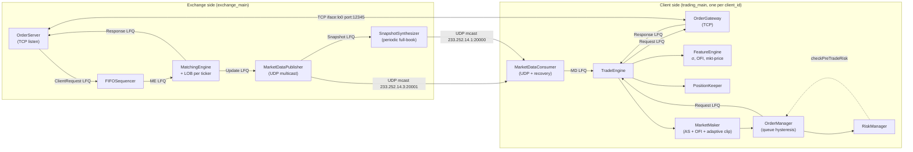

# Electronic Trading Ecosystem

[](https://en.cppreference.com/w/cpp/20)
[](https://cmake.org/)
[](#build)
[](#quickstart)

A from-scratch C++20 low-latency electronic trading ecosystem: matching engine + UDP multicast market data + TCP order entry + algorithmic trading client + inventory-aware market-making strategy. Built following Sourav Ghosh's *Building Low Latency Applications with C++* (Packt, 2023) chapters 5–12, with v1.1 strategy upgrades on top:

- **Avellaneda-Stoikov** inventory-aware quoter (replaces the v1.0 threshold-pennying heuristic)
- **Cont-Kukanov-Stoikov OFI** alpha overlay on the reservation price
- **Queue-position hysteresis** in the OrderManager (preserves queue priority across small price shifts)
- **Adaptive clip** sizing (shrinks near inventory limits and in high σ)
- **Tape-replay backtest** harness that drives the *same* `MarketMaker` against a Binance/Synth tape and emits per-strategy PnL CSVs
- **RDTSC + TTT** instrumentation everywhere (Ch11), with per-tag latency histograms dumped at shutdown (Day 1) and a Darwin-affinity-hint jitter benchmark (Day 6)

**Reference reading:**

- [`STRATEGY.md`](STRATEGY.md) — math + code map for AS / OFI / hysteresis / adaptive clip
- [`PERF.md`](PERF.md) — every percentile, every benchmark, reproducible
- [`notebooks/strategy_compare.html`](notebooks/strategy_compare.html) — 4-strategy comparison plots (no Python install needed)

---

## Architecture



Every red edge in the diagram above is an `LFQueue<T>` — a pre-allocated, lock-free, single-producer / single-consumer ring buffer. There is **no mutex or condition variable anywhere on a hot path**.

---

## Quickstart

### 1. Backtest — 4-strategy comparison on a synthetic tape

```bash
cd electronic_trading_ecosystem
bash build.sh
bash scripts/run_all_strategies.sh                 # runs baseline / as / as_ofi / full
python3 scripts/plot.py pnl                        # → docs/pnl.png
# or just open notebooks/strategy_compare.html in a browser
```

### 2. Live demo — exchange + RANDOM + MAKER

```bash
bash scripts/run_demo.sh                           # 30s session, prints percentiles,
                                                   # dumps latency_*_*.hgrm,
                                                   # writes docs/latency.png
```

### 3. Per-component benchmarks (Ch12) + jitter (Day 6)

```bash
./cmake-build-release/logger_benchmark             # ~54x speedup vs naive logger
./cmake-build-release/release_benchmark            # ~25x speedup on MemPool under NDEBUG
./cmake-build-release/hash_benchmark               # array-based LOB baseline
./cmake-build-release/jitter_benchmark unpinned 5 docs/jitter_unpinned.hgrm
./cmake-build-release/jitter_benchmark pinned   5 docs/jitter_pinned.hgrm
python3 scripts/plot.py jitter                     # → docs/jitter.png
```

### 4. Bare-metal live run (manual)

```bash
./cmake-build-release/exchange_main &              # boot exchange, wait ~10s
# v1.1 MAKER, 8 tickers, full AS + OFI + hysteresis + adaptive clip
MPER='100 0.5 100 1000 -1e9  1 0.1 1.5 6.5  1 0.5 1 1 1.0'
./cmake-build-release/trading_main 1 MAKER \
  $MPER $MPER $MPER $MPER $MPER $MPER $MPER $MPER
```

SIGINT (`Ctrl+C`) triggers a graceful shutdown — `TradeEngine::stop()` drains queues, prints the POSITIONS dump, and dumps the per-tag latency histograms.

> Important — RiskCfg::max_loss_: the check is `total_pnl_ < max_loss_`, so it's a **min-PnL floor**, not a max loss. Use `-1e9` to effectively disable it. Positive values will cause the strategy never to trade.

---

## What's interesting

### v1.0 — infrastructure (Sourav Ghosh chapters 5–12)

- **Zero-allocation hot path** — pre-allocated `MemPool<T>` + lock-free SPSC `LFQueue<T>` everywhere; `placement new` for object reuse.
- **Async lock-free logger** — per-component log file fed by an `LFQueue<LogElement>` + dedicated drain thread; **block-copy string variant is 54× faster than per-char**.
- **`NDEBUG`-gated MemPool** — both `ASSERT()`s in `allocate()` / `deallocate()` compile away in release; **25× faster** alloc/dealloc.
- **macOS-friendly** — `poll()`-based fallback for `epoll`, `SO_REUSEPORT` for multi-client UDP MD; thread affinity is best-effort with an explicit `THREAD_AFFINITY_POLICY` hint and an honest "this is a hint, not a hard pin" comment.
- **Cycle-accurate instrumentation** — `RDTSC` cycle deltas for every hot function (`Trading_FeatureEngine_onOrderBookUpdate`, `Exchange_MEOrderBook_match`, etc.); absolute-nanosecond `TTT` timestamps at every queue/socket boundary.

### v1.1 — strategy

- **Avellaneda-Stoikov quoter** ([`trading/strategy/market_maker.cpp:54-92`](trading/strategy/market_maker.cpp)) — `reservation = mid − q·γ·σ²·τ + β·OFI`, `spread = γ·σ²·τ + (2/γ)·ln(1+γ/κ)`, don't-cross-the-book guard. Inventory and σ feed in from `PositionKeeper` and a new EWMA estimator in `FeatureEngine`.
- **Cont-Kukanov-Stoikov OFI** ([`trading/strategy/feature_engine.h`](trading/strategy/feature_engine.h)) — piecewise-signed Δbid_qty minus Δask_qty, EWMA-smoothed.
- **Queue-position hysteresis** ([`trading/strategy/order_manager.h::moveOrder`](trading/strategy/order_manager.h)) — per-ticker dead-zone preserves queue priority while target price drifts within `hysteresis_ticks_` of the live order.
- **Adaptive clip** — shrinks order size near inventory limits and in high σ.
- **Backtest harness** ([`backtest/`](backtest/)) — replays a tape through the exact same `MarketMaker` code path used live, simulates fills via BBO crossing + a queue-position model, emits per-strategy PnL CSVs.

### Day 1, 4, 6 polish

- **Per-tag latency histograms** dumped at shutdown — log2 buckets, single-writer, no atomics. See [`PERF.md`](PERF.md) §1.
- **`std::function` dispatch eliminated** — `nm trading_main | grep std::function<void` → 0. See [`PERF.md`](PERF.md) §2.
- **macOS thread-affinity jitter benchmark** showing **11.6× max-jitter reduction** with the Darwin hint. See [`PERF.md`](PERF.md) §3.

### Side bugs fixed along the way

- `MarketOrderBook::onMarketUpdate` skipped `updateBBO` on the very first ADD because `bid_updated` checked `bids_by_price_ != null` *before* the add. Strategies keyed off BBO never quoted in tests with cold-start books. Fixed.
- `FeatureEngine` EWMA volatility was permanently NaN because `prev_mid_ != Feature_INVALID` is true when both operands are NaN (IEEE 754). `std::isnan(prev_mid_)` is correct.
- Top-level `CMakeLists.txt` linked `libcommon` before its consumers — Apple ld doesn't care, GNU ld does. Reordered for Linux compatibility.
- `RiskCfg::max_loss_` semantics documented in `STRATEGY.md` — see the Quickstart warning above.

---

## Threading Model

Each major component runs on its own dedicated OS thread. Cross-thread communication is **exclusively** via `LFQueue<T>` — no mutexes, no condition variables, no shared mutable state.

| Thread | Component | Cross-thread channels |
|--------|-----------|-----------------------|
| `Exchange/MatchingEngine` | Core LOB matching | in: ClientRequest LFQ; out: ClientResponse + MarketUpdate LFQs |
| `Exchange/OrderServer` | TCP order gateway server | in: ClientResponse LFQ; out: ClientRequest LFQ (via FIFOSequencer) |
| `Exchange/MarketDataPublisher` | UDP multicast feed | in: MarketUpdate LFQ; out: Snapshot LFQ → SnapshotSynthesizer |
| `Exchange/SnapshotSynthesizer` | Periodic full-book snapshot | in: Snapshot LFQ |
| `Trading/MarketDataConsumer` | UDP multicast subscriber + recovery | out: MD LFQ |
| `Trading/OrderGateway` | TCP order client | in: outgoing-request LFQ; out: incoming-response LFQ |
| `Trading/TradeEngine` | Strategy + position + risk | in: MD LFQ + response LFQ; out: outgoing-request LFQ |
| `Common/Logger` (one per file) | Async log flusher | in: `LFQueue<LogElement>` |

---

## Repository structure

```
electronic_trading_ecosystem/
├── CMakeLists.txt
├── build.sh
├── README.md           STRATEGY.md           PERF.md
│
├── common/              # low-latency building blocks
│   ├── macros.h         types.h          time_utils.h
│   ├── mem_pool.h       lf_queue.h       thread_utils.h
│   ├── logging.{h,cpp}  perf_utils.h     latency_histogram.h    (Day 1)
│   ├── opt_logging.h    opt_mem_pool.h                          (Ch12)
│   ├── socket_utils.h   tcp_socket.{h,cpp}  tcp_server.{h,cpp}
│   └── mcast_socket.{h,cpp}
│
├── exchange/            # exchange-side
│   ├── exchange_main.cpp
│   ├── order_server/    client_request.h  client_response.h
│   │                    fifo_sequencer.h  order_server.{h,cpp}
│   ├── market_data/     market_update.h
│   │                    market_data_publisher.{h,cpp}
│   │                    snapshot_synthesizer.{h,cpp}
│   └── matcher/         me_order.{h,cpp}  me_order_book.{h,cpp}
│                        matching_engine.{h,cpp}
│
├── trading/             # client-side
│   ├── trading_main.cpp
│   ├── market_data/     market_data_consumer.{h,cpp}
│   ├── order_gw/        order_gateway.{h,cpp}
│   └── strategy/        trade_engine.{h,cpp}
│                        feature_engine.h   position_keeper.h
│                        market_order_book.{h,cpp}
│                        market_maker.{h,cpp}                     (v1.1: AS + OFI)
│                        liquidity_taker.{h,cpp}
│                        order_manager.h                          (v1.1: hysteresis)
│                        risk_manager.{h,cpp}
│
├── backtest/            # v1.1 — tape-replay harness
│   ├── backtest_main.cpp  backtest_engine.{h,cpp}
│   └── binance_tape_reader.{h,cpp}
│
├── benchmarks/          # Ch12 + Day 6 measurement binaries
│   ├── logger_benchmark.cpp    release_benchmark.cpp
│   ├── hash_benchmark.cpp      jitter_benchmark.cpp             (Day 6)
│
├── scripts/             # demo + plot drivers
│   ├── run_demo.sh             (Day 1 — live)
│   ├── run_all_strategies.sh   (v1.1 — 4-strategy backtest)
│   └── plot.py                 (subcommands: latency / pnl / jitter)
│
├── notebooks/           # rendered analysis
│   ├── strategy_compare.{ipynb,html}                            (v1.1)
│   ├── perf_analysis.{ipynb,html}                               (Ch12)
│   └── img/             (5 PNGs)
│
└── docs/                # outputs of the above
    ├── latency.png            latency_summary.csv               (Day 1)
    ├── pnl.png                                                   (v1.1)
    └── jitter.png             jitter_pinned.hgrm                (Day 6)
                               jitter_unpinned.hgrm
```

---

## Build

```bash
cd electronic_trading_ecosystem
bash build.sh
```

Requirements: CMake ≥ 3.16, GCC ≥ 11 or Clang ≥ 14 with C++20, ninja (or make). On Linux the build defines NDEBUG and uses GNU-ld's strict link order; on macOS Apple-ld is order-insensitive so both work.

### macOS note on thread affinity

`pthread_setaffinity_np` is Linux-only. On Darwin we use `thread_policy_set(THREAD_AFFINITY_POLICY)` which is a *hint*, not a hard pin — see `common/thread_utils.h::pinCurrentThreadDarwinHint` and [`PERF.md`](PERF.md) §3 for the measured 11.6× max-jitter reduction and the honest "this isn't `isolcpus`" caveat. Run on Linux for production-grade isolation.

---

## What's in scope, what's not

**In scope (this repo):**

- Full matching engine + LOB + market data + order entry + trading client, single-machine, kernel sockets, loopback.
- Inventory-aware market-making strategy with measured backtest.
- Per-tag cycle-level instrumentation and percentile reporting.
- macOS-honest measurement of scheduler jitter.

**Out of scope (deferred — see [`STRATEGY.md`](STRATEGY.md) "What we deliberately did not do"):**

- DPDK / ef_vi / kernel bypass NIC paths (needs real hardware + Linux).
- FPGA / hardware-accelerated risk gating (needs Arista 7130 / Algo-Logic class hardware).
- GLFT model, VPIN toxicity gating, regime-switching HMM.
- Multi-level / ladder quoting (would restructure `OrderManager::OMOrderTickerSideHashMap`).
- Real FIX 4.4 / SBE wire encoding (would replace the bespoke `#pragma pack(1)` protocol).
- Linux `isolcpus` / `chrt` real-time scheduling (out of scope on Darwin).

---

## References

- **Book:** Sourav Ghosh, *Building Low Latency Applications with C++* (Packt, 2023) — chapters 5–12 form the v1.0 baseline.
- **AS:** Marco Avellaneda & Sasha Stoikov, *High-frequency trading in a limit order book* (2008).
- **OFI:** Rama Cont, Arseniy Kukanov & Sasha Stoikov, *The Price Impact of Order Book Events*, *Journal of Financial Econometrics* 12(1), 2014.
